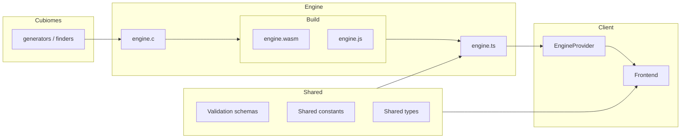

# Architecture

High-level view of how SeedAtlas is put together.

## Overview

SeedAtlas runs **entirely in the browser**. The WASM module embeds cubiomes; there is no backend seed service.

## Monorepo layout

| Package | Path | Responsibility |
|---------|------|----------------|
| `@repo/client` | `apps/client` | UI, routing, map rendering, structure/biome |
| `@repo/engine-wasm` | `packages/engine-wasm` | Build cubiomes → WASM; export TS API |
| `@repo/shared` | `packages/shared` | Domain constants and request/response types |

Root scripts delegate to [Turbo](https://turbo.build): `dev`, `build`, `start`, `format`, `check`, `type-check`.

## Engine layer

- C `src/native/engine.c` — thin wrapper around cubiomes
- Build `scripts/build.sh` — compiles cubiomes + `engine.c` with Emscripten
- TypeScript `src/engine.ts` — module singleton, export registry, and public API

## Shared layer

**Constants** — ids aligned with cubiomes headers:

- `MINECRAFT_VERSIONS`, `BIOMES`, `STRUCTURES`, `DIMENSIONS`, `BIOME_HEIGHTS`, `BIOME_SCALING`

**Validation** — Validation schemas for:

- `CommonSearchContext` (seed, version, dimension, biome height, origin, large biomes)
- `MapRequest` / `MapResponse` (viewport, zoom, optional grid)
- `FinderRequest` / `FinderResponse` (biome/structure search)

UI and engine should share these types.

## Client layer

- **Router**: TanStack Router, file-based routes under `src/app`
- **Engine**: `WasmEngineProvider` loads WASM once; consume with `useWasmEngine` hook
- **Styling**: Mantine + SCSS

## Key design choices

| Choice | Reason |
|--------|--------|
| WASM + cubiomes | Same algorithms as desktop tools; no server cost; works offline |
| xpple fork submodule | Features beyond upstream Cubitect (versions, loot tables, etc.) |
| Thin C wrapper | Keep rebuild surface small; logic stays in cubiomes |
| `@repo/shared` | One source of truth for ids, labels, and API shapes |
| Client-side only | Simple deploy (static hosting / gh-pages); privacy-friendly |

## Related docs

- [Roadmap](roadmap.md) — what ships when
- [Cubiomes](cubiomes.md) — submodule workflow and change boundaries
